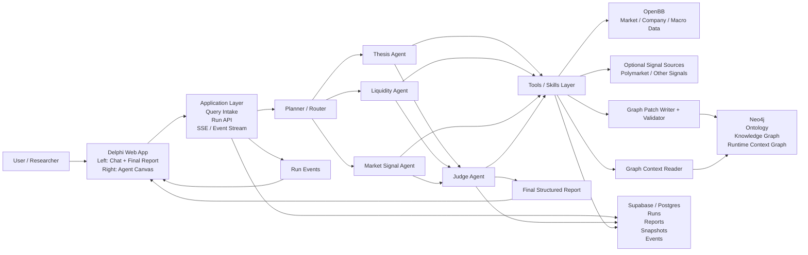
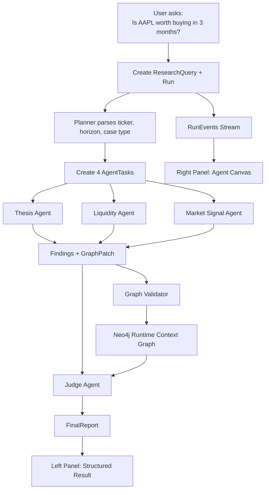

# Delphi Architecture Diagram

这份文档提供两样东西：

1. 一版可直接预览的 Mermaid 架构图
2. 一版适合在 Excalidraw 中重绘的布局说明

## 1. System Architecture

## 2. Runtime Flow

## 3. Excalidraw Redraw Guide

如果你在 Excalidraw 里重画，我建议用 5 列布局，从左到右：

1. `User`
2. `Product Layer`
3. `Agent Runtime Layer`
4. `Tools + Graph Control Layer`
5. `Data / Storage Layer`

### Column 1

- 一个用户节点：
  - `Retail Researcher / Builder`

### Column 2

- 一个大框：
  - `Delphi Web App`
- 框内上下分成两块：
  - `Left: Chat + Final Report`
  - `Right: Agent Canvas`

### Column 3

- 顶部：
  - `Planner / Router`
- 中部横向 4 个小框：
  - `Thesis Agent`
  - `Liquidity Agent`
  - `Market Signal Agent`
  - `Judge Agent`

### Column 4

- 一个大框：
  - `Tools / Skills Layer`
- 框下再放两个控制节点：
  - `Graph Context Reader`
  - `Graph Patch Writer + Validator`

### Column 5

- 两个竖向大框：
  - `Neo4j`
    - Ontology
    - Knowledge Graph
    - Runtime Context Graph
  - `Supabase / Postgres`
    - Runs
    - Reports
    - Snapshots
    - Events
- Neo4j 上方可再放两个外部数据源：
  - `OpenBB`
  - `Optional Signal Sources`

## 4. Visual Guidance For Demo / Thesis

- 用 `blue` 表示产品层
- 用 `orange` 表示 agent runtime
- 用 `green` 表示 tools / graph control
- 用 `gray` 表示数据与外部源

建议强调 4 条关键箭头：

- `User -> Delphi`
- `Planner -> 4 Agents`
- `Agents -> Graph Patch Writer + Validator`
- `Judge -> Final Structured Report`

## 5. Caption Suggestion

可直接用于论文或演示页的图注：

> Delphi v0 architecture. The system transforms a single-stock natural language research query into a bounded multi-agent workflow, where structured findings and graph patches are validated and written into a runtime context graph before a Judge agent synthesizes the final report.
