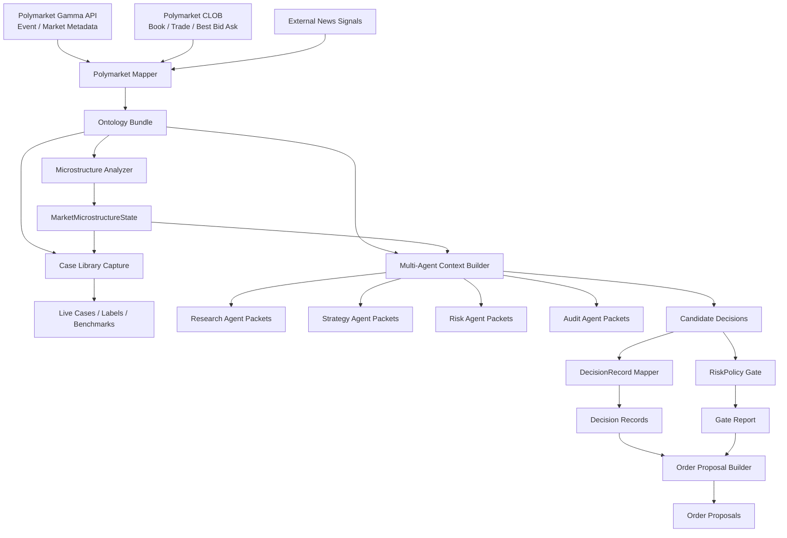

# Polymarket to Multi-Agent to Pre-Trade Flow Overview (v0.1)

## 1. Goal
This document provides a full-picture view of the Polymarket engineering flow currently implemented in Delphi:
1. how raw market data enters the system,
2. where ontology and microstructure analysis apply,
3. where a future multi-agent runtime should plug in,
4. how `DecisionRecord`, `RiskPolicy gate`, and `Order proposal` fit together before execution.

This is not a future-only blueprint. It is an overview of what already exists in the repo as runnable or near-runnable infrastructure.

## 2. End-to-end flow

## 3. Layer-by-layer explanation
### 3.1 Raw data layer
Inputs:
1. Gamma API: `Event / Market / OutcomePrices / liquidity / volume`
2. CLOB: `book / last_trade_price / best_bid_ask / price_change`
3. external news signals

Problems at this layer:
1. fields are source-oriented, not agent-oriented,
2. world semantics and price formation are mixed together,
3. shallow books can easily mislead downstream consumers.

### 3.2 Ontology layer
Current output: `ontology bundle`

Core role:
1. semanticize `Event / Market / Outcome / NewsSignal / ResolutionState`,
2. separate world semantics from price-formation mechanics,
3. provide a stable, explicit, traceable object layer for agents.

### 3.3 Microstructure layer
Current outputs:
1. `OrderBookSnapshot`
2. `TradePrint`
3. `LiquiditySnapshot`
4. `MarketMicrostructureState`

Core role:
1. explain how the current market price is formed,
2. detect shallow books, wide spreads, tiny-print distortions, and trade-only anomalies,
3. emit:
   - `displayed_probability`
   - `robust_probability`
   - `book_reliability_score`
   - `trade_reliability_score`
   - `manipulation_risk_score`
   - `signal_weights`
   - `explanatory_tags`

### 3.4 Multi-agent consumption layer
Current output: `multi-agent context`

This is not the runtime. It is the contract.

The repo can already produce:
1. `research_agent_packets`
2. `strategy_agent_packets`
3. `risk_agent_packets`
4. `audit_agent_packets`
5. `candidate_decisions`

Meaning:
1. each agent does not need to re-parse ontology or raw payloads,
2. different agents can consume different but consistent views of the same market,
3. the Risk Agent can intervene earlier.

### 3.5 Pre-trade semantic layer
Current outputs:
1. `DecisionRecord`
2. `RiskPolicy gate report`
3. `Order proposals`

Current runnable chain:
`candidate_decisions -> DecisionRecord -> RiskPolicy gate -> Order proposal`

Important:
1. this is not yet a full execution runtime,
2. this is not yet paper trading,
3. but it already defines the minimum output contract from future agents into the execution domain.

## 4. Why this matters for a future multi-agent system
A future multi-agent system should not be wired as:
`raw market data -> agents`

The better integration path is:
`raw market data -> ontology / microstructure -> multi-agent context -> agents`

Why:
1. agents no longer face messy source fields,
2. agents do not each need their own market-signal-quality heuristics,
3. Research/Strategy/Risk/Audit can share one consistent semantic market layer,
4. later execution and audit become much easier to trace.

## 5. Key existing files
### 5.1 Data and ontology
- `scripts/ontology/fetch_polymarket_public_snapshot.py`
- `scripts/ontology/polymarket_mapper.py`
- `scripts/ontology/polymarket_microstructure.py`
- `ontology/schemas/polymarket-ontology.schema.json`

### 5.2 Case library and benchmark
- `scripts/ontology/capture_polymarket_case_library.py`
- `scripts/ontology/manage_live_case_labels.py`
- `scripts/ontology/benchmarks/evaluate_microstructure_cases.py`

### 5.3 Multi-agent bridge
- `scripts/ontology/build_multi_agent_context.py`
- `ontology/samples/multi-agent/polymarket-agent-context-sample.json`
- `docs/en/08-Polymarket-Ontology-Multi-Agent-Consumption-Contract-v0.1.md`

### 5.4 Pre-trade chain
- `scripts/ontology/build_decision_records.py`
- `scripts/ontology/evaluate_risk_policy_gate.py`
- `scripts/ontology/build_order_proposals.py`
- `ontology/samples/execution-derived/decision-records-sample.json`
- `ontology/samples/execution-derived/risk-gate-report-sample.json`
- `ontology/samples/execution-derived/order-proposals-sample.json`

## 6. Current boundary
1. there is still no full multi-agent orchestration runtime,
2. `candidate_decisions` are still heuristic drafts,
3. `RiskPolicy gate` is still a minimum rule set,
4. `Order proposal` is not yet actual execution or paper trading,
5. there is no `Execution -> Position/PnL` closed loop yet.

## 7. Recommended development order
1. keep the ontology / microstructure / benchmark layer stable,
2. when multi-agent work starts, consume `multi-agent context` directly,
3. if execution work continues, prioritize a paper-trading stub before a live runtime.

## 8. One-line summary
At this stage, Delphi is no longer just “raw market ingestion”. It already has:
**a full foundation from market semantics, to signal-quality analysis, to multi-agent input contracts, to a pre-trade semantic chain.**
