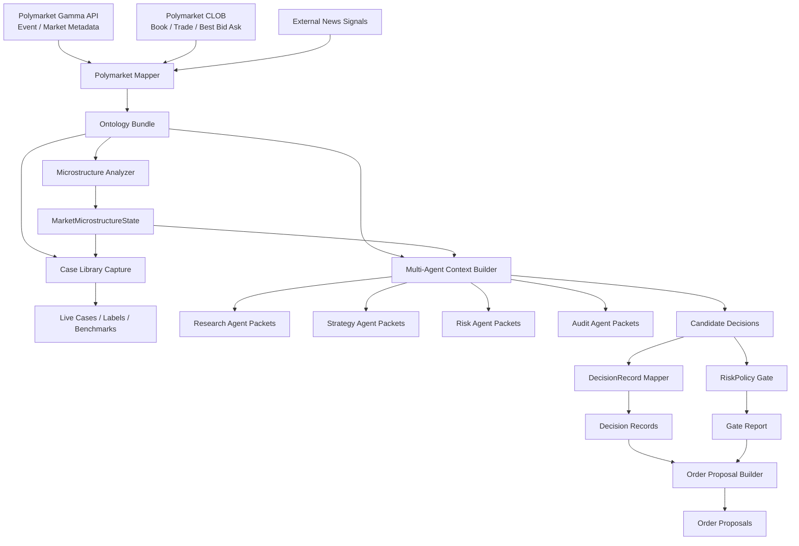

# Polymarket 到多 Agent 到执行前链路总览（v0.1）

## 1. 目标
这份文档提供一张全景图，解释 Delphi 当前已经实现的 Polymarket 相关工程链路：
1. 原始市场数据如何进入系统。
2. ontology 和 microstructure 在哪里发挥作用。
3. 多 Agent 未来应该接在哪一层。
4. 执行前的 `DecisionRecord`、`RiskPolicy gate`、`Order proposal` 如何衔接。

这不是未来蓝图，而是当前仓库里已经落地或已经可运行的链路总览。

## 2. 总链路

## 3. 分层说明
### 3.1 原始数据层
输入来源：
1. Gamma API：`Event / Market / OutcomePrices / liquidity / volume`
2. CLOB：`book / last_trade_price / best_bid_ask / price_change`
3. 外部 news signals

这层的问题是：
1. 字段是源系统导向的，不是 Agent 理解导向的。
2. 价格信号和世界语义混在一起。
3. 浅盘口时很容易误导下游系统。

### 3.2 Ontology 层
当前产物：`ontology bundle`

核心作用：
1. 把 `Event / Market / Outcome / NewsSignal / ResolutionState` 这些对象语义化。
2. 把世界语义与价格形成过程解耦。
3. 给 Agent 提供稳定、显式、可追踪的对象关系层。

### 3.3 Microstructure 层
当前产物：
1. `OrderBookSnapshot`
2. `TradePrint`
3. `LiquiditySnapshot`
4. `MarketMicrostructureState`

核心作用：
1. 判断当前市场价格是如何形成的。
2. 判断是否存在浅盘口、宽 spread、小额拉盘、trade-only distortion。
3. 产出：
   - `displayed_probability`
   - `robust_probability`
   - `book_reliability_score`
   - `trade_reliability_score`
   - `manipulation_risk_score`
   - `signal_weights`
   - `explanatory_tags`

### 3.4 多 Agent 消费层
当前产物：`multi-agent context`

这层不是 runtime，而是 contract。

当前已经能为不同 agent 产出不同输入包：
1. `research_agent_packets`
2. `strategy_agent_packets`
3. `risk_agent_packets`
4. `audit_agent_packets`
5. `candidate_decisions`

意义：
1. 不需要让每个 agent 自己重解析 ontology/raw payload。
2. 不同 agent 可以基于同一 market 得到不同但一致的视图。
3. `Risk Agent` 可以更早介入，而不是等到执行前才发现问题。

### 3.5 执行前语义层
当前产物：
1. `DecisionRecord`
2. `RiskPolicy gate report`
3. `Order proposals`

当前链路已经可跑通：
`candidate_decisions -> DecisionRecord -> RiskPolicy gate -> Order proposal`

注意：
1. 这还不是正式 execution runtime。
2. 这也还不是 paper trading。
3. 但它已经定义好了多 Agent 输出如何进入执行域的最小 contract。

## 4. 现在这层对未来多 Agent 的价值
如果以后你开始做多 Agent，最合理的接法不是：
`raw market data -> agents`

而是：
`raw market data -> ontology / microstructure -> multi-agent context -> agents`

原因：
1. Agent 不再直接面对原始脏字段。
2. Agent 不需要各自发明一套“市场价格是否可信”的规则。
3. Research/Strategy/Risk/Audit 可以共享一套统一的市场语义基础。
4. 后续 execution 和 audit 更容易追踪。

## 5. 当前已经存在的关键文件
### 5.1 数据与 ontology
- `scripts/ontology/fetch_polymarket_public_snapshot.py`
- `scripts/ontology/polymarket_mapper.py`
- `scripts/ontology/polymarket_microstructure.py`
- `ontology/schemas/polymarket-ontology.schema.json`

### 5.2 case library 与 benchmark
- `scripts/ontology/capture_polymarket_case_library.py`
- `scripts/ontology/manage_live_case_labels.py`
- `scripts/ontology/benchmarks/evaluate_microstructure_cases.py`

### 5.3 多 Agent bridge
- `scripts/ontology/build_multi_agent_context.py`
- `ontology/samples/multi-agent/polymarket-agent-context-sample.json`
- `docs/zh/08-Polymarket-Ontology-多Agent消费契约-v0.1.md`

### 5.4 执行前链路
- `scripts/ontology/build_decision_records.py`
- `scripts/ontology/evaluate_risk_policy_gate.py`
- `scripts/ontology/build_order_proposals.py`
- `ontology/samples/execution-derived/decision-records-sample.json`
- `ontology/samples/execution-derived/risk-gate-report-sample.json`
- `ontology/samples/execution-derived/order-proposals-sample.json`

## 6. 当前边界
1. 当前还没有真正的多 Agent orchestration runtime。
2. 当前 `candidate_decisions` 仍是 heuristic draft。
3. 当前 `RiskPolicy gate` 仍是最小规则集。
4. 当前 `Order proposal` 还没有进入真正的 execution / paper trading。
5. 当前还没有 `Execution -> Position/PnL` 闭环。

## 7. 现阶段最适合的开发顺序
1. 保持当前 ontology / microstructure / benchmark 层稳定。
2. 若开始做多 Agent，直接消费 `multi-agent context`。
3. 若继续推进执行域，优先做 paper trading stub，而不是直接上实盘 runtime。

## 8. 一句话总结
当前 Delphi 在 Polymarket 这条链路上，已经不是“原始市场抓取脚本”，而是：
**从市场语义理解，到信号质量判断，到多 Agent 输入契约，再到执行前语义链路的一整套基础设施。**
